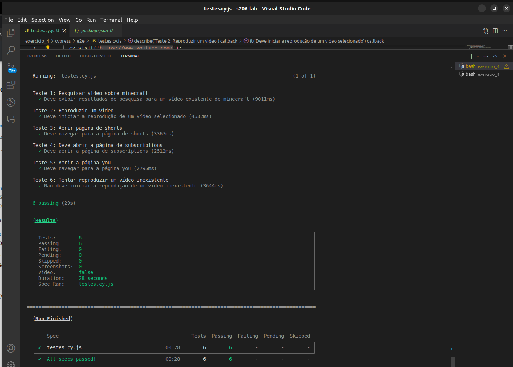

# Exercício 4

Este é um projeto Cypress para testar funcionalidades no YouTube.

## Executando o Projeto

Siga os passos abaixo para executar os testes e gerar relatórios:

### Executando o Projeto
Siga os passos abaixo para executar os testes e gerar relatórios:

#### Instale as Dependências:

```bash
npm install
```

#### Execute os Testes e Gere os Relatórios:

```bash
npm run test:report
```

#### Merge dos Relatórios:

```bash
npm run report:merge
```


#### Gere o Relatório Final:

```bash
npm run report:generate
```


## Resultado dos Testes:

